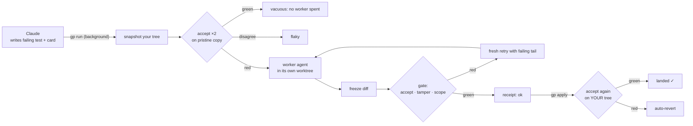

<div align="center">

# 🔭 glass-pipe

### Claude thinks. Your other agents build. Tests decide what ships.

**Hand Claude Code's implementation sub-tasks to coding agents on lower-cost plans (OpenCode Go today, Codex next), behind a red-before-green gate. Claude gets back a one-line receipt, not a transcript.**

[](https://github.com/aniloncloud/glass-pipe/actions/workflows/ci.yml)
[](pyproject.toml)
[](pyproject.toml)
[](LICENSE)
[](#-roadmap)

[Why](#-why) · [How it works](#-how-it-works) · [Under the hood](docs/ARCHITECTURE.md) · [Quickstart](#-quickstart) · [Cards](#-cards) · [Safety](#-safety-model) · [Scorecard](#-proving-it-works) · [Roadmap](#-roadmap)

</div>

```text
you     ▸ /gp:opencode stream CSV rows instead of buffering the whole file
claude  ▸ writes tests/test_export.py::test_stream (fails today), sends one card
gp      ▸ gp#a3f9c1 ok opencode/opencode-go/deepseek-v4.1-flash 1try 1f +12-7 accept✓ · semantic conflicts unchecked → .glass/jobs/a3f9c1/receipt.txt
claude  ▸ gp apply a3f9c1
gp      ▸ gp#a3f9c1 applied landed✓ 1f · semantic conflicts unchecked
```

**~25 tokens back to Claude per job. About $0.001–$0.003 per small fix on OpenCode Go. 12–22 s end to end in the live tests.**

---

## 🤔 Why

If you live in Claude Code on a Max plan, **the session window is the scarce resource**. Meanwhile your Codex or OpenCode Go plan sits mostly idle. The existing bridges spend Claude tokens three times on every delegation:

| Cost | Typical bridge (e.g. `/codex:rescue`) | glass-pipe |
|---|---|---|
| Dispatch | A forwarding **subagent** (full system prompt + skills) | **One background Bash call** |
| Result | The worker's **whole output pasted back** | **One line**, about 25 tokens. Details on disk. |
| Review | Claude usually re-reads the diff | **The gate decides**. Claude only reads on exceptions. |
| Retries | Claude drives them | The **worker** retries itself |

glass-pipe moves the *implementation work* off your Claude budget, but not Claude's *judgment*. Claude still plans and writes the failing test. **The test is the spec, and the gate is the reviewer.**

## ⚙️ How it works



1. **Snapshot.** Your working tree is captured, uncommitted and untracked files included, into a pinned commit. Your tree is never touched while the job runs.
2. **Baseline first.** The accept command runs **twice** on a pristine copy. Already green? That's `vacuous`: the test doesn't test the change, so no worker is spent. The two runs disagree? That's `flaky`.
3. **Brief.** The worker gets the failing assertion inlined, the test to read first, the files it may write, and hard rules: no test edits, no skip markers, no git writes.
4. **Gate.** The diff is **frozen before** accept runs, so the test command can't write the green. Then tamper and scope are checked. On red, the worker retries fresh with the failing tail.
5. **Receipt.** One stdout line. The full receipt, patch and logs live in `.glass/jobs/<id>/`.
6. **Apply.** The clean path only applies if the files are unchanged since the snapshot. Otherwise you get `dirty`, with the reason. Then accept runs again **on your real tree**. If that's red, gp reverts automatically.

Every receipt says **`semantic conflicts unchecked`**, on purpose. The gate only knows what your test tests.

```
  Claude ──card──▶ gp run ──▶ [ snapshot ]──▶[ baseline ×2 ]──▶[ worker in worktree ]──▶[ freeze ]──▶[ gate ]
     ▲                                          │ green/flaky:            │ sandboxed: can't touch     │ red: fresh
     │                                          │ stop, $0 spent          │ your repo, no MCP          │ retry
     └────────── one line ◀──────── receipt ◀───────────────────────────────────────────────────────────┘
                     │
                     └─ gp apply ──▶ [ files unchanged? ]──▶[ accept on YOUR tree ]──▶ landed ✓ | auto-revert
```

📖 **[Under the hood →](docs/ARCHITECTURE.md)** covers processes, the job lifecycle, both sandboxes, the classification order, what's on disk, and the exact brief the worker receives.

## 🚀 Quickstart

**Requirements:**
- macOS, or Linux with `bwrap`.
- Python 3.11+ and git.
- [OpenCode](https://opencode.ai) logged in with an OpenCode Go plan.
- Claude Code 2.1.91 or later.

**1. Install the plugin** (inside Claude Code):

```text
/plugin marketplace add aniloncloud/glass-pipe
/plugin install gp@glass-pipe
```

The plugin ships the `gp` CLI on Claude's PATH, so there's nothing else to install for Claude. Prefer the shell?

```bash
claude plugin marketplace add aniloncloud/glass-pipe
claude plugin install gp@glass-pipe
```

**2. Set up a project** (once per repo). Run `gp init` in Claude Code with the `!` prefix, or in your terminal:

```text
!gp init --write-settings
```

This writes `.glass/config.toml`, git-ignores `.glass/`, and adds allow rules for `gp` commands to `.claude/settings.local.json`.

**3. Delegate:**

```text
/gp:opencode make the CSV exporter stream rows instead of buffering
```

<details>
<summary><b>Share it with your team</b>: pre-configure the marketplace in the repo's <code>.claude/settings.json</code></summary>

```json
{
  "extraKnownMarketplaces": {
    "glass-pipe": { "source": { "source": "github", "repo": "aniloncloud/glass-pipe" } }
  },
  "enabledPlugins": { "gp@glass-pipe": true }
}
```

Teammates are offered the plugin after they trust the folder.
</details>

<details>
<summary><b>Use <code>gp</code> from your own terminal, or hack on glass-pipe</b></summary>

```bash
git clone https://github.com/aniloncloud/glass-pipe ~/glass-pipe
ln -s ~/glass-pipe/bin/gp ~/.local/bin/gp        # gp on your PATH
claude --plugin-dir ~/glass-pipe                 # load the plugin from the checkout
```

Driving it by hand:

```bash
gp run <<'EOF'
{"to":"opencode","goal":"make tests/test_export.py::test_stream pass","accept":"pytest -q tests/test_export.py::test_stream","scope":["src/export/csv.py"]}
EOF
gp apply <id>
```
</details>

> **Tip:** if your Claude Code version still prompts on the `gp run <<'EOF'` heredoc form, set `auto_allow_gp = true` in `.glass/config.toml`. The plugin's hook will then approve plain `gp` commands, and only those.

## 🃏 Cards

A card is one JSON object per line:

```jsonc
{
  "to": "opencode",                                      // worker name from .glass/config.toml
  "goal": "make tests/test_export.py::test_stream pass",
  "accept": "pytest -q tests/test_export.py::test_stream", // ONE allowlisted runner command, no && | >
  "scope": ["src/export/csv.py"],                        // implementation files the worker may write (required)
  "notes": ["mirror the style of src/export/json.py"],   // optional guidance, max 5 short lines
  "kind": "refactor",                                    // optional: green before AND after (needs your stamp)
  "edit_tests": true                                     // optional: let the worker touch tests (needs your stamp)
}
```

Rules, enforced before any job starts:
- **`scope` is required.** It never means "the whole repo".
- **Test files can't be in scope,** unless `edit_tests` is set.
- **Cards in one batch must touch disjoint paths.** A directory overlaps everything under it.
- **`accept` must be an allowlisted test runner:** pytest, `python -m pytest|unittest`, `npm|bun|pnpm|yarn test`, `cargo test`, `go test`, tsc, eslint, ruff, or mypy. You can extend the list in config.

## 🧭 Steering the worker

| Channel | Scope | How |
|---|---|---|
| **Card notes** | One task | `"notes": ["…"]`. Shown under the rules, never above them. |
| **Retry with a hint** | One task, after `fail` | `gp retry <id> --hint "add means a + b"`. A fresh run with your hint, linked to the original. |
| **Binding constraints** | Every future brief | `gp note --kind constraint --harness claude --text "never import numpy in src/"` |
| **Your repo's `AGENTS.md`** | Every task | OpenCode reads it from the worktree. Your *global* OpenCode config is deliberately **not** loaded. |

## 🚦 Statuses

| Status | Meaning | What happens |
|---|---|---|
| `ok` | Red → green, in scope, no tamper | **Eligible** for `gp apply` |
| `vacuous` | Already green before the worker | No worker spent. Your test doesn't test the change. |
| `flaky` | The two baseline runs disagree | No worker spent. Fix the test. |
| `env` / `env-missing` | The test couldn't run, or needs an ignored file you didn't list | No worker spent. Fix the environment, or add the file to `env_files`. |
| `fail` | Still red after retries | `gp show <id> --why`, then `gp retry --hint` |
| `tamper` | Touched a protected test or config, added a skip marker, or the test wrote the tree | Never applied, unless you override it |
| `scope` | Wrote outside the card's scope | Never applied |
| `tests-edited` / `behavior-unchanged` | Allowed exceptions | Applied only after **your** stamp: `gp note --job <id> --kind stamp --harness human` |
| `dirty` (on apply) | Your files changed since the snapshot | Patch kept. The receipt says which job or edit caused it. |
| `landing-red` (on apply) | Green in the worktree, red on your tree | **Auto-reverted**, byte-for-byte |
| `quota` / `auth` / `unavailable` | The worker's plan can't take the job | Falls back to the other worker **once** |

## 🛡️ Safety model

| Threat | Defense |
|---|---|
| A worker edits your repo directly and skips the gate | Each job's OpenCode **server runs in a write-allowlist sandbox** (`sandbox-exec` / `bwrap`): only that job's worktree, OpenCode's session data and a private tmp are writable. |
| A worker hijacks gp through its worktree's `.git` | gp **never trusts a worktree's `.git`**. Every git call uses the admin dir recorded at creation, with hooks and fsmonitor disabled. |
| A worker uses your MCP servers, plugins or API keys | Each job gets **its own OpenCode server**: empty config, no MCP, no plugins, password-protected, and an **allowlisted environment** with no API keys. It can't write OpenCode's plugin cache, so it can't plant code for your next run. `question`, `webfetch`, `websearch`, `execute`, `subagent` and `skill` are denied. |
| A worker reads your credentials | `~/.ssh`, `~/.aws`, `~/.config/gh`, `~/.gnupg`, `~/.kube`, `~/.docker`, `~/.netrc` and similar are **read-denied** in every sandbox. |
| The test command writes outside the tree, or phones home | Accept runs sandboxed. Writes go only to the worktree and a **private per-run TMPDIR**, and the network is limited to loopback. |
| The landing check runs the worker's code on your tree | Inside your repo it may write **only inert test debris**: not your code, `.git`, `.glass`, `.venv`, or bytecode. |
| The worker "fixes" the test instead of the code | Tests, conftest, fixtures and runner config are protected. Skip, `only` and xfail markers, symlinks and mode changes are all tamper. The diff is frozen before accept runs. |
| A green but wrong patch lands | Red-before-green is required. Accept re-runs on your tree, with automatic revert. LIFO `gp undo`. |
| Claude approves its own exceptions | Human stamps are refused without an interactive terminal, and a hook denies Claude's attempts. This is a guardrail against **accidental** self-approval, not a boundary: see SECURITY.md. Stamped work never counts as delegated. |

The project had an independent pre-publication security audit. Every confirmed finding is fixed and regression-tested.

**Honest limits:**
- **Workers can still read** other user-readable files, including OpenCode's own provider login.
- **Workers can still reach the network,** because the model API needs it.
- **Applied code is code you will run.** Review the diffs that matter.
- **This is a personal tool,** not a multi-tenant dispatcher.

See [SECURITY.md](SECURITY.md).

## 📊 Proving it works

Token savings prove nothing if the patch gets reverted that night. `gp stats` counts a card as a **successful offload** only if all five of these hold:

| Counter | Passes when |
|---|---|
| **landed** | The clean apply worked, and accept is green on your tree afterwards |
| **gate-accepted** | The status was `ok`. Stamped exceptions don't count. |
| **stayed** | No undo, and no fix-up commit on those files within 7 days |
| **not-rescued** | Claude didn't edit the scope files afterwards. The plugin's edit-log hook tracks this. |
| **card-stable** | The goal and accept command weren't rewritten, and the test wasn't loosened after submit |

```text
$ gp stats            # example output
cards submitted: 12
successful offloads: 9/12  (landed ∧ gate-accepted ∧ stayed ∧ not-rescued ∧ card-stable; window 7d)
offload rate: 81%   vacuous rate: 8%   net time: median 0.6 min submit→stayed apply
```

**gp never prints a savings number without these counters next to it.**

## 🔌 Claude Code plugin

The plugin (manifest in `.claude-plugin/`, components in `adapters/claude-plugin/`) adds about **123 tokens** of always-loaded context: command and skill descriptions only. Each body loads only when used.

| Piece | What it does |
|---|---|
| `/gp:opencode <task>` | The test-first delegation flow |
| `/gp:ask <question>` | A read-only answer from the worker model, capped at about 400 tokens. Its server can't edit or run a shell. |
| `/gp:apply <id>` | Clean-path apply with the landing check |
| `glass-pipe` skill | Tells Claude when to delegate, and when not to: trivial edits, design questions |
| Hooks | A session-start news line, but only when there's news. An edit log for the scorecard. A self-stamp guard. Optional `gp` auto-allow. |

## 🧰 Commands

```text
gp run [--cards FILE]          start cards (JSONL on stdin) and wait (one line per job)
gp retry <id> --hint "…"       fresh run of a job's card with your hint
gp wait <id>…                  re-attach to running jobs
gp show <id> [--why]           full receipt (+ failing output)
gp diff <id>                   the frozen patch
gp apply <id> / gp undo <id>   clean-path apply with landing check / LIFO undo
gp ask "<question>" [--long]   read-only, capped answer
gp status / gp drop <id>|--stale
gp note --kind constraint|decision --text "…" [--harness claude|human] [--job <id>]
gp stats [--window-days 7]     the five-counter scorecard
gp init [--write-settings]     set up a repo
```

## 🧪 Tests

```bash
uv run --with pytest pytest                       # 200 unit + integration tests, scripted fake worker, $0
GP_LIVE=1 uv run --with pytest pytest tests/live  # 6 tests against real OpenCode Go (a few cents)
```

The suite was written test-first. The sandbox test came before any other code, and it caught a real fail-open: the shared system tmp was writable. Golden-prompt tests pin exactly what the worker is told.

## 🗺️ Roadmap

| Phase | Status | What |
|---|---|---|
| 0 | ✅ | Spike: worker command lines, sandbox write-denial, cache TTL (findings folded into [docs/ARCHITECTURE.md](docs/ARCHITECTURE.md)) |
| 1 | ✅ | Gate engine with a scripted fake worker |
| 2 | 🟡 | OpenCode worker ✅ · Codex worker ⏳ |
| 3 | ✅ | Claude Code plugin (advisory mode) |
| 4 | ⏳ | **Decision point:** 5 real tasks via glass-pipe, via `/codex:rescue`, and via Claude directly. Scorecard plus tokens. |
| 5 | 💭 | Gated on Phase 4: routed and strict modes, multi-card DAGs, racing, a repo primer |

The full design, including every review round, is in [docs/PLAN.md](docs/PLAN.md).

## ❓ FAQ

**Is this a replacement for Claude subagents?**
No. Claude keeps the judgment: planning, tests, exceptions. glass-pipe takes over the typing: implementations whose acceptance is a test.

**What if I don't have tests?**
Then glass-pipe isn't the right tool for that task. It deliberately refuses to accept work without a red-to-green signal.

**Why not just call `opencode run` from Claude?**
You'd lose the isolation, the gate, the landing check and the scorecard. You'd also paste the transcript back into your Claude session.

**Does it phone home?**
No. glass-pipe has zero runtime dependencies and no telemetry. Workers talk only to their own model API.

## 🤝 Contributing

See [CONTRIBUTING.md](CONTRIBUTING.md). Issues and PRs are welcome, especially worker adapters and Linux (`bwrap`) testing.

## 📄 License

[MIT](LICENSE)
